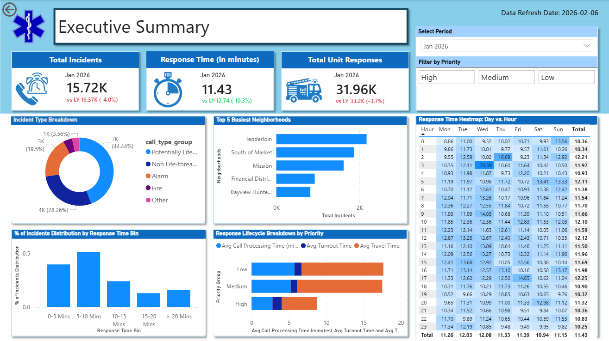
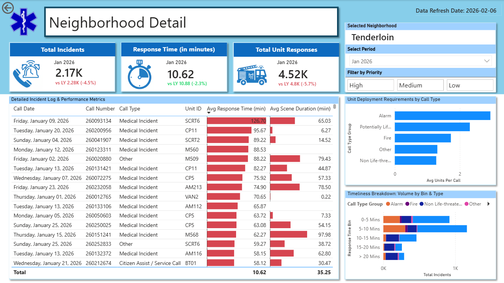
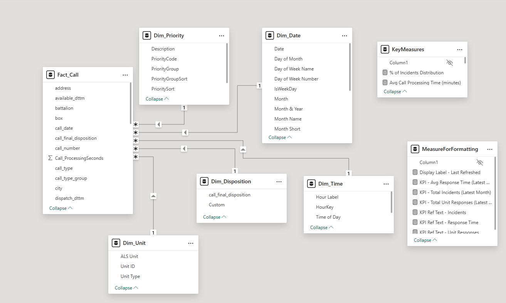

# 🚑 San Francisco Emergency Response Dashboard (Power BI)

### 📊 Project Overview
This project is a comprehensive Business Intelligence solution designed to analyze emergency dispatch performance. Using **San Francisco Fire & EMS open data**, it simulates a real-world operational dashboard for a 911 center (similar to E-Comm 911).

**🚀 Quick Access:**
* [**👉 View Live Interactive Dashboard**](https://app.powerbi.com/links/2k8PmfR3YT?ctid=8322cefd-0a4c-4e2c-bde5-b17933e7b00f&pbi_source=linkShare) *(Best for viewing visuals)*
* [**📂 Download .pbix Source File**](https://drive.google.com/file/d/1H-dLFQVHeCoH5U_2R1KybBpTa0uoMbhT/view) *(Hosted on Drive due to 300MB file size)*
---

### 📷 Dashboard Preview

**1. Executive Overview**
*High-level view of Call Volumes and Average Response Times.*

**2. Operational Details**
*Drill-through analysis of incident types and unit performance.*

**3. Data Model (Star Schema)**
*Optimized schema with dedicated Date Dimension.*

---

### 🛠️ Technical Highlights

#### 1. Advanced Data Modeling
* Engineered a robust **Star Schema** to optimize query performance for millions of dispatch records.
* Created a dedicated **Date Dimension** using M Code (Power Query) to enable Time Intelligence functions.

#### 2. Complex DAX Calculations
* **Response Time Analysis:** Calculated weighted averages for critical KPI tracking.
* **Time Intelligence:** Implemented `CALCULATE` and `USERELATIONSHIP` to analyze data by both "Received Date" and "Dispatch Date".

#### 3. UX & Interactivity
* Designed **Drill-through** functionality to allow users to navigate from high-level trends to granular incident details.
* Implemented dynamic filtering for different Unit Types (Engine, Truck, Medic).

---

### 📂 Data Source
* **Source:** [San Francisco Fire Department Calls for Service] - https://data.sfgov.org/Public-Safety/Fire-Department-and-Emergency-Medical-Services-Dis/nuek-vuh3/about_data
* **Dataset:** Includes Call Number, Unit ID, Call Type, Received DtTm, Dispatch DtTm, and On Scene DtTm.

### 📂 Data Documentation
To ensure clarity on the metrics and column definitions used in this analysis, I have included a detailed Data Dictionary:
👉 [**View Data Dictionary**](./DataDictionary.xlsx) 
*(Contains definitions for Call Types, Unit IDs, and Timestamp Logic)*

### 📬 Contact
* **Jill Lau**
* LinkedIn: [Jill Lau](https://www.linkedin.com/in/jill-data)
